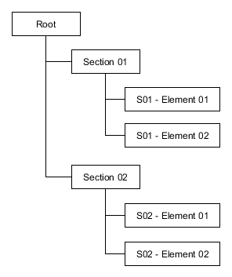

Hierarchical Structures
=======================

Quite often we deal with complex data sets which elements keep some kind of
hierarchical structure. They are usually represented using a tree:

It is possible to create complex tree-like structures like the one above using
the :func:`HItem <cue.obj.hitem.HItem>` object as it provides a
series of methods that allows you to specify hierarchical relationships between
objects. It also provides methods to get information about its parent/children
so navigating the tree is piece of cake!

.. toctree::
   :hidden:
   :maxdepth: 2

   hitem_create
   hitem_define
   hitem_repr
   hitem_example01
